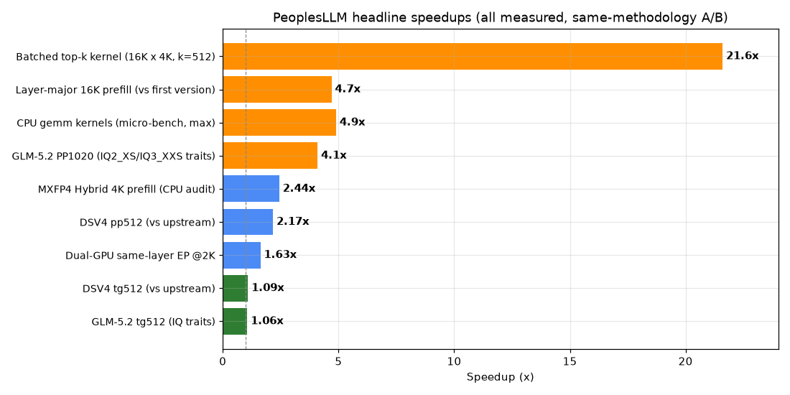
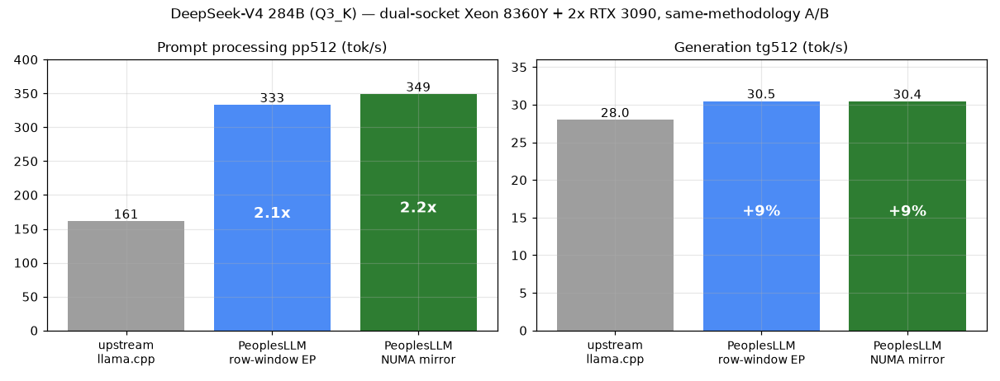
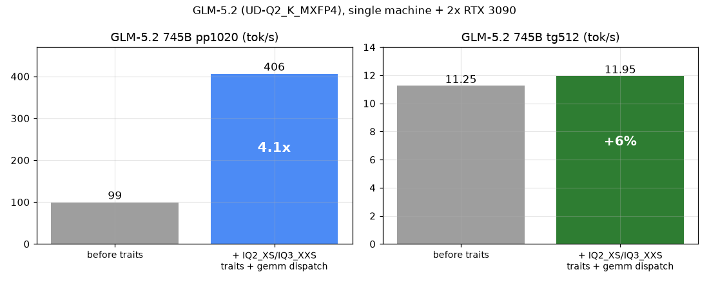
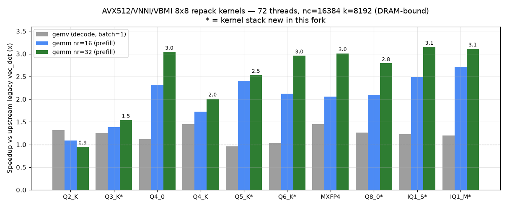
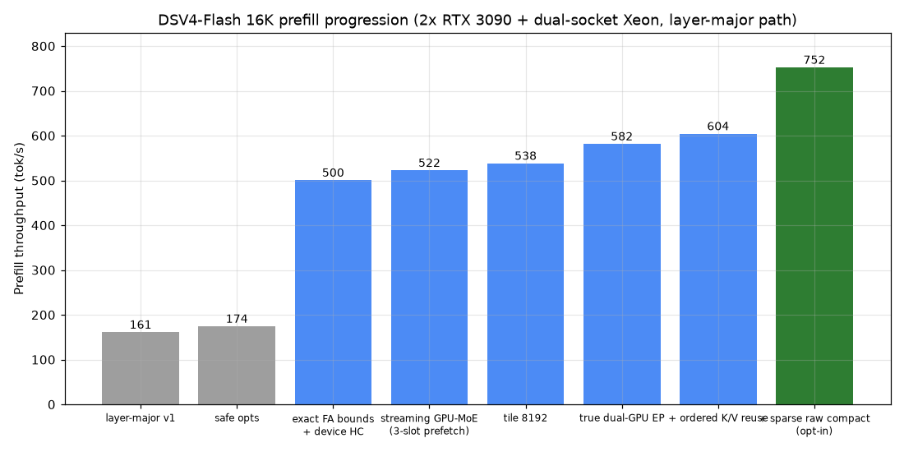
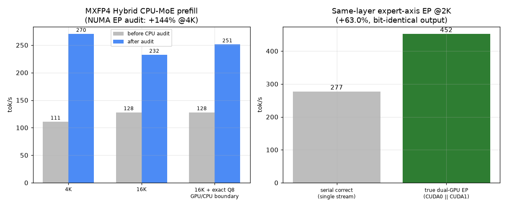
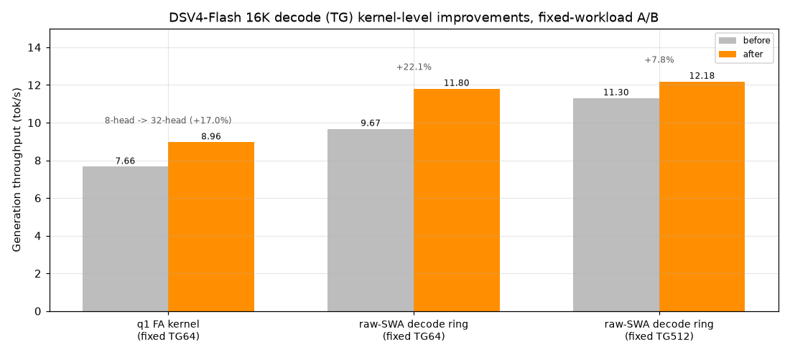
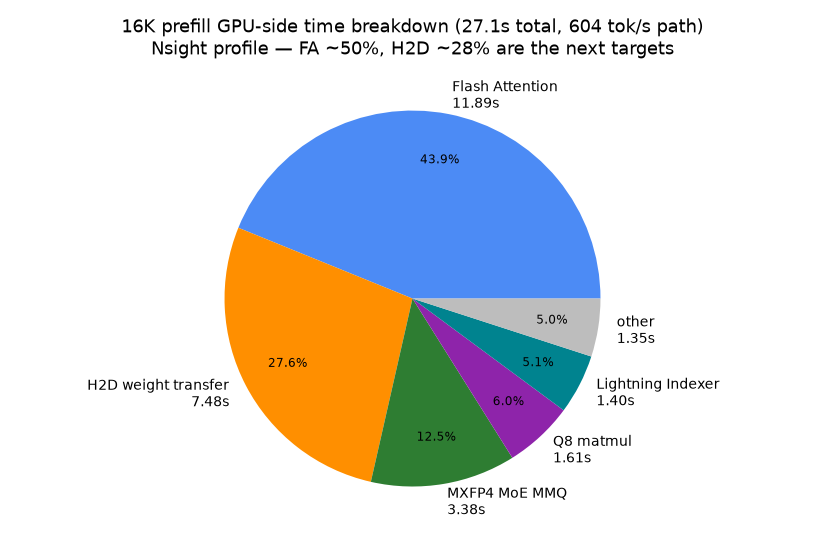
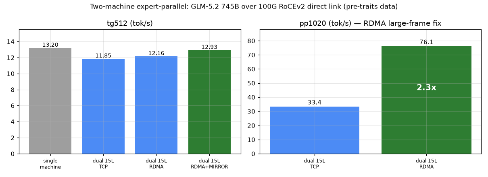
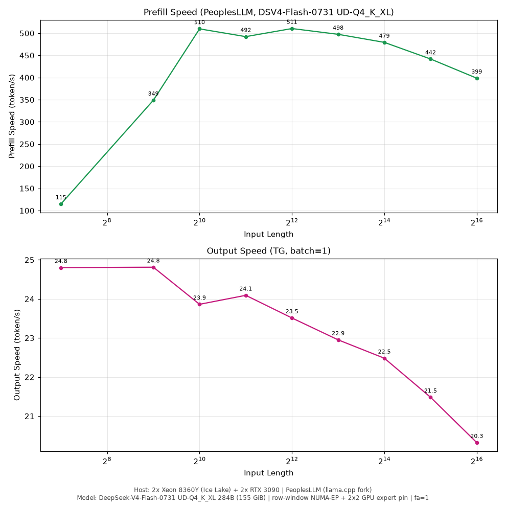

# PeoplesLLM

> **[中文 README →](README.md)**

**Run 200B–3T-parameter MoE models locally on cheap hardware — fast.**
A specialized llama.cpp fork for dual/multi-socket CPU servers plus consumer GPUs, with four self-developed optimization tracks: CPU compute kernels, the NUMA subsystem, GPU long-context prefill, and cross-machine expert parallelism.

## About

The author comes from a hardware background; all design, coding, testing and tuning in this project were done by AI (Kimi K3 + Kimi Code CLI) — the author only picks the technical directions (EP, GEMM kernels, AVX512/VNNI/VBMI, NUMA, etc.). The code may not be pretty and may contain bugs; it is only guaranteed on the author's own rig (dual Xeon 8360Y + 2× RTX 3090). Main tuning targets: **DeepSeek-V4 / DSV4-Flash** and **GLM-5.2**. Issues welcome.

Test platform: dual Xeon 8360Y (Ice Lake, 152 threads, 251G RAM) + 2× RTX 3090 24G (NVLink) + a ConnectX-5 100G direct-linked slave (dual Ice Lake ES, 188G). Baseline = upstream llama.cpp, same machine, same methodology A/B.

## Features

### CPU inference

| Feature | When to use | Impact |
|---|---|---|
| **AVX512/VNNI/VBMI 8×8 repack kernels** (Q2_K–Q6_K, Q8_0, MXFP4, IQ1_S/IQ1_M/IQ2_XS/IQ3_XXS) | All CPU compute; biggest win on long-prompt batches | prefill gemm up to **4.9×** (micro-bench); GLM-5.2 end-to-end **PP 4.1×** |
| **NUMA mirror** (`--numa mirror`) | Dual-socket servers with RAM to spare | Best TG (**+9%** vs upstream), zero cross-socket UPI traffic |
| **NUMA row-window EP** (`GGML_NUMA_EP=1`) | RAM-constrained, loading oversized models | **Half the expert memory**, TG matches mirror, single-writer dst rows with zero merge |
| **Fused ops** (hyper-connection HC, MoE router, RMS_NORM absorption, DSA Lightning Indexer) | DSV4 / GLM everywhere | Eliminates decomposed paths and intermediate activation traffic |
| **MTP speculative decoding** | DSV4 decode | Further TG gains (all numbers here are without MTP) |

### GPU inference (long context)

| Feature | When to use | Impact |
|---|---|---|
| **Layer-major long prefill** (`llama_decode_layer_major()`, layer weights resident in CUDA slots) | 4K–1M long prompts | 16K PP 161→**604 tok/s** (**752** with sparse compact opt-in), 4.7× |
| **Streaming MoE prefill + 3-slot dual-GPU prefetch** | Hybrid inference with expert weights in host RAM | Each layer's weights uploaded once, reused across tiles |
| **True dual-GPU same-layer expert-axis EP** (`GGML_CUDA_MOE_PP_EP`, opt-in) | Dual-GPU prefill | 2K PP **+63%** (277→452 tok/s), bit-identical output |
| **Batched top-k** (`GGML_CUDA_BATCHED_TOPK`) | DSA sparse-attention models, long context | top-k kernel **21.6×**, e2e PP +8.2% |
| **q1 32-head FA / raw-SWA decode ring** | Long-context decode | fixed TG64 **+17%** / TG512 **+7.8%** (ring opt-in, in validation) |
| **GPU expert offload** (`-ot blk.N.ffn_*_exps=CUDA0/1`) | Spare VRAM | ~+1% TG per offloaded layer |

### Cross-machine distributed EP (`tools/epd/`)

| Feature | When to use | Impact |
|---|---|---|
| **Cross-machine expert parallelism** (activation dispatch, KB-scale traffic — not weight transfer) | Model doesn't fit in one machine's RAM | DSV4 two-machine matches single-machine speed with **26% less** master RAM |
| **RoCEv2 RDMA transport** (`GGML_REMOTE_EP_RDMA=1`, automatic TCP fallback) | IB/RoCE NICs; plain gigabit falls back seamlessly | RTT 42-74µs→**10-13µs**; after the large-frame fix, PP1020 33.4→**76.1 tok/s (2.3×)** |
| **MAX-EFFORT layer mirroring** (`GGML_REMOTE_EP_MIRROR=1`) | Spare master RAM, decode-heavy workloads | Remote segment leaves the critical path, TG **+9~11%** |
| **EP planner** (`tools/epd/ep-plan.py`) | Pre-deployment layer-split decisions | Recommends splits from measured bandwidth/latency, calibration error ≤1.5% |

### Model support

DeepSeek-V4 / DSV4-Flash (incl. native MXFP4), GLM-5.2 (DSA), MiniMax-M3; plus a byte-level GGUF repair toolchain (quant-block corruption scan + patch — fixed 138 corrupted blocks in the official GLM-5.2 file that caused garbled output).

## Benchmarks

### vs upstream llama.cpp (same machine, same methodology A/B)

DeepSeek-V4 284B (Q3_K), 14 expert layers on GPU, 72 threads:

Both row-window EP and mirror beat upstream: **PP 2.1-2.2×, TG +9%**; row-window EP additionally halves expert memory. For PP-first or single-socket scenarios the isolate config reaches pp512 370 tok/s.

### GLM-5.2 745B: IQ traits + gemm dispatch

### CPU kernels: 8×8 repack vs upstream legacy vec_dot

gemv (decode) ≈1× is the physical memory-bandwidth ceiling; the prefill gemm gains come from amortizing weight-read bandwidth via 8×8 repacking. Full 300-cell dataset reproducible via `tests/test-repack-kernels --perf`.

### Long context: layer-major prefill (DSV4-Flash, 16K)

The native MXFP4 build (155GB; 137GiB experts as a single CPU_REPACK copy on dual-socket NUMA EP) gained +144% on 4K PP after a three-part CPU audit.

### Long-context decode (16K, fixed-workload A/B)

Long-context TG degradation was root-caused to the physical dense scan of GPU attention/KV and is being fixed item by item. 16K GPU-side breakdown (Nsight):

### Two-machine expert-parallel (GLM-5.2, 100G RoCEv2 direct link)

### Production server: DSV4-Flash, 8 slots × 1M context

8 slots sharing 1M context (128K each); PP peaks at 511 tok/s (ubatch 1024-4096); TG stays flat at 20-25 tok/s across all input lengths.

> All numbers are measured; methodology and reproduction in `docs/CHANGES.md` and `docs/benchmarks/` (plot scripts included). Rejected routes (full tensor split -44%, meta-backend TP -20%, cross-tile dual scheduler) are also documented.

## Docs

- **[docs/CHANGES.md](docs/CHANGES.md)** — full changelog (NUMA architecture, CPU kernel format matrix, fused ops, distributed EP; Chinese)
- **[docs/PEOPLESLLM-PARAMS.md](docs/PEOPLESLLM-PARAMS.md)** — all env/CLI parameters and production recipes
- **[docs/DEVELOPMENT.md](docs/DEVELOPMENT.md)** — build, test and branch conventions
- **[docs/LONG-CONTEXT-1M.md](docs/LONG-CONTEXT-1M.md)** — 1M-context memory/VRAM budget and acceptance gates
- **[tools/epd/README.md](tools/epd/README.md)** — two-machine EP quick start

## Status

Early development; `main` branch = production-ready. Ongoing: GPU prefill toward vLLM/KTransformers-class throughput (16K target 1000+ tok/s), CPU/GPU joint pipelining, and a unified weight representation for GPU-prefill/CPU-decode. Upstream tracking: based on llama.cpp `e8f19cc0a` (2026-07-16); `vendor` branch holds the base, merged regularly.

## License & Copyright

This project is a fork of [llama.cpp](https://github.com/ggml-org/llama.cpp). **The original project is copyrighted by ggml-org and the llama.cpp contributors** and released under the MIT License. All modifications in this fork are likewise released under the MIT License, with the original copyright and license notices retained (see [LICENSE](LICENSE)).
