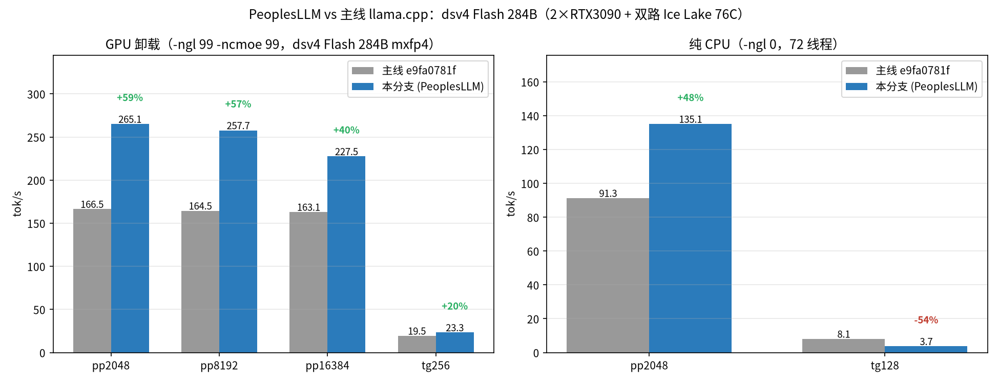
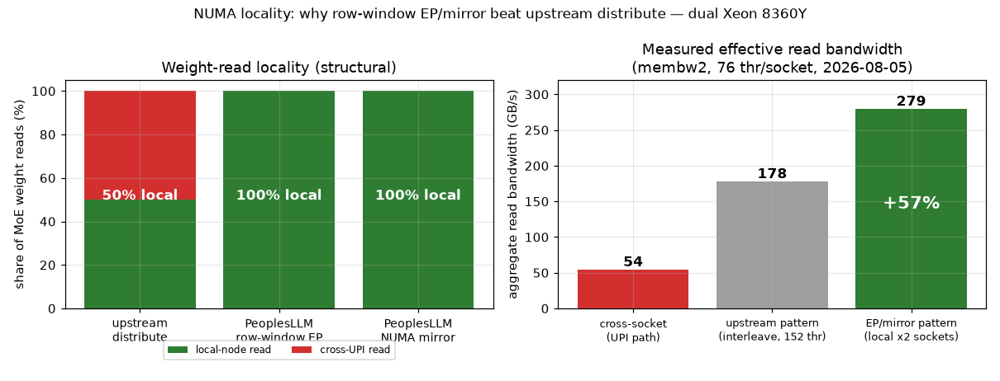
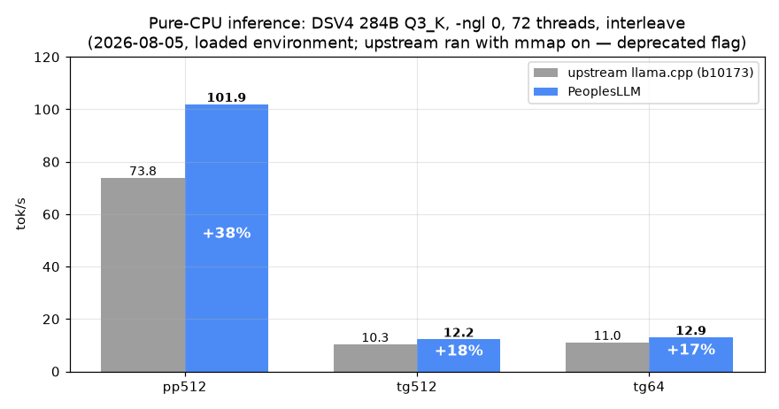
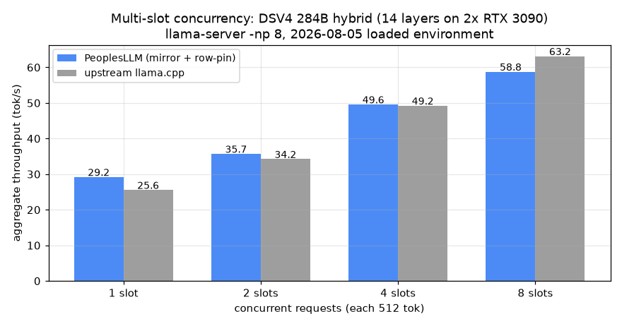
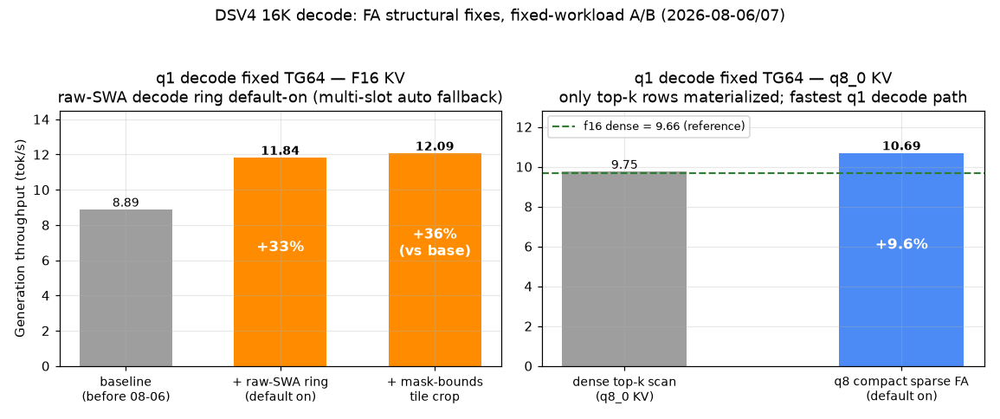

# PeoplesLLM

> **[中文 README →](README.md)**

**Run 200B–3T-parameter MoE models locally on cheap hardware — fast.**
A specialized llama.cpp fork for dual/multi-socket CPU servers plus consumer GPUs, with four self-developed optimization tracks: CPU compute kernels, the NUMA subsystem, GPU long-context prefill, and cross-machine expert parallelism.

## About

The author comes from a hardware background; all design, coding, testing and tuning in this project were done by AI (Kimi K3 + Kimi Code CLI) — the author only picks the technical directions (EP, GEMM kernels, AVX512/VNNI/VBMI, NUMA, etc.). The code may not be pretty and may contain bugs; it is only guaranteed on the author's own rig (dual Xeon 8360Y + 2× RTX 3090). Main tuning targets: **DeepSeek-V4 / DSV4-Flash** and **GLM-5.2**. Issues welcome.

Test platform: dual Xeon 8360Y (Ice Lake, 152 threads, 251G RAM) + 2× RTX 3090 24G (NVLink) + a ConnectX-5 100G direct-linked slave (dual Ice Lake ES, 188G). Baseline = upstream llama.cpp, same machine, same methodology A/B.

## Features

### CPU inference

| Feature | When to use | Impact |
|---|---|---|
| **AVX512/VNNI/VBMI 8×8 repack kernels** (Q2_K–Q6_K, Q8_0, MXFP4, IQ1_S/IQ1_M/IQ2_XXS) | All CPU compute; biggest win on long-prompt batches | prefill gemm up to **4.9×** (micro-bench); GLM-5.2 end-to-end **PP 4.1×** |
| **IQ2_XXS AVX512 repack gemv/gemm kernel** (x8 layout) | CPU inference of IQ2_XXS-weight models | gemv micro-bench **17×**; full-model A/B still flat (bottleneck is the uncovered expert mul_mat_id) — model-level gains pending extension |
| **NUMA mirror** (`--numa mirror`) | Dual-socket servers with RAM to spare | Best TG (**+9%** vs upstream), zero cross-socket UPI traffic |
| **NUMA row-window EP** (`GGML_NUMA_EP=1`) | RAM-constrained, loading oversized models | **Half the expert memory**, TG matches mirror, single-writer dst rows with zero merge |
| **Fused ops** (hyper-connection HC, MoE router, RMS_NORM absorption, DSA Lightning Indexer) | DSV4 / GLM everywhere | Eliminates decomposed paths and intermediate activation traffic |
| **MTP speculative decoding** | DSV4 decode | Further TG gains (all numbers here are without MTP) |

### GPU inference (long context)

| Feature | When to use | Impact |
|---|---|---|
| **Layer-major long prefill** (`llama_decode_layer_major()`, layer weights resident in CUDA slots) | 4K–1M long prompts | 16K PP 161→**604 tok/s** (**752** with sparse compact opt-in), 4.7× |
| **Streaming MoE prefill + 3-slot dual-GPU prefetch** | Hybrid inference with expert weights in host RAM | Each layer's weights uploaded once, reused across tiles |
| **True dual-GPU same-layer expert-axis EP** (`GGML_CUDA_MOE_PP_EP`, opt-in) | Dual-GPU prefill | 2K PP **+63%** (277→452 tok/s), bit-identical output |
| **Batched top-k** (`GGML_CUDA_BATCHED_TOPK`) | DSA sparse-attention models, long context | top-k kernel **21.6×**, e2e PP +8.2% |
| **q1 32-head FA + raw-SWA decode ring** (ring on by default; `LLAMA_DSV4_COMPACT_DECODE_SWA=0` to disable) | Long-context decode | q1 decode graph width decoupled from prompt length: fixed TG64 8.89→**12.09** (+33~36%), TG512 +4~8%; automatic fallback for multi-slot |
| **q8 compact sparse FA** (on by default, q8_0 KV) | Long-context decode with q8 KV | q1 decode materializes only top-k selected rows: TG64 9.75→**10.69** (+10%) — fastest q1 decode path (beats f16 dense); f16 fused sparse stays opt-in (16K measured -12%) |
| **Multi-stream (small-q) sparse FA** (`LLAMA_DSV4_FUSED_INDEXED_FA=3/4`, `LLAMA_DSV4_Q8_SPARSE_FA=2`, opt-in) | Multi-slot concurrent decode | Correctness verified three-way byte-identical; parity at ≤16K (weight-bandwidth bound), payoff targeted at 256K+ context |
| **GPU streaming prefill** (plan A, server integration) | Long prompts in llama-server | Full-tile path PP 63→**127.6 tok/s** (2×); falls back to chunked via eligibility gate under compact ring SWA cache, `--swa-full` to enable |
| **GPU expert offload** (`-ot blk.N.ffn_*_exps=CUDA0/1`) | Spare VRAM | ~+1% TG per offloaded layer |

### Cross-machine distributed EP (`tools/epd/`)

| Feature | When to use | Impact |
|---|---|---|
| **Cross-machine expert parallelism** (activation dispatch, KB-scale traffic — not weight transfer) | Model doesn't fit in one machine's RAM | DSV4 two-machine matches single-machine speed with **26% less** master RAM |
| **RoCEv2 RDMA transport** (`GGML_REMOTE_EP_RDMA=1`, automatic TCP fallback) | IB/RoCE NICs; plain gigabit falls back seamlessly | RTT 42-74µs→**10-13µs**; after the large-frame fix, PP1020 33.4→**76.1 tok/s (2.3×)** |
| **MAX-EFFORT layer mirroring** (`GGML_REMOTE_EP_MIRROR=1`) | Spare master RAM, decode-heavy workloads | Remote segment leaves the critical path, TG **+9~11%** |
| **EP planner** (`tools/epd/ep-plan.py`) | Pre-deployment layer-split decisions | Recommends splits from measured bandwidth/latency, calibration error ≤1.5% |

### Model support

DeepSeek-V4 / DSV4-Flash (incl. native MXFP4), GLM-5.2 (DSA), MiniMax-M3; plus a byte-level GGUF repair toolchain (quant-block corruption scan + patch — fixed 138 corrupted blocks in the official GLM-5.2 file that caused garbled output).

## Latest progress (2026-08-06/07)

- **raw-SWA decode ring on by default** (branch fa-decode-fix): q1 decode graph width decoupled from prompt length — fixed TG64 8.894→11.837/12.085 tok/s (+33~36%), TG512 +4~8%; automatic fallback to full-width semantics in multi-slot scenarios.
- **q8 compact sparse FA on by default**: with q8_0 KV, q1 decode materializes only top-k selected rows — TG64 9.75→10.69 (+10%), TG512 +1.3%, now the fastest q1 decode path (beats f16 dense); f16 fused sparse stays opt-in (16K measured -12%, to be re-evaluated at longer context).
- **Multi-stream (small-q) sparse FA** (opt-in, `LLAMA_DSV4_FUSED_INDEXED_FA=3/4`, `LLAMA_DSV4_Q8_SPARSE_FA=2`): sparse extension for multi-slot concurrent decode, verified three-way byte-identical; performance parity at ≤16K (weight-bandwidth bound), payoff targeted at 256K+ context.
- **GPU streaming prefill** (plan A, server integration): full-tile path PP 63→127.6 tok/s (2×) on long prompts; automatic fallback to chunked via an eligibility gate under compact ring SWA cache, `--swa-full` to enable; fingerprints bit-exact across all four test groups.
- **IQ2_XXS AVX512 kernel**: gemv micro-bench **17×**; full-model A/B flat (3.78→3.71, bottleneck is the uncovered expert mul_mat_id) — a micro-benchmark win with model-level extension still pending.

## Benchmarks

### vs upstream llama.cpp (same machine, same methodology A/B)

DeepSeek-V4 284B (Q3_K), 14 expert layers on GPU, 72 threads:

Both row-window EP and mirror beat upstream: **PP 2.1-2.2×, TG +9%**; row-window EP additionally halves expert memory. For PP-first or single-socket scenarios the isolate config reaches pp512 370 tok/s.

### Full-range re-measurement vs upstream (2026-08-07, DSV4-Flash 284B mxfp4, production shape)

Upstream `e9fa0781f` vs this branch (incl. Q2_K/mxfp4 VNNI dpbusd conversion), same-machine same-methodology llama-bench A/B. **GPU offload (-ngl 99 -ncmoe 99 EP, production shape): PP +40~59% across the board (pp2048 265.1 vs 166.5, pp8192 257.7 vs 164.5, pp16384 227.5 vs 163.1), TG +20% (23.3 vs 19.5)**. Pure CPU (-ngl 0): PP +48% (135.1 vs 91.3); TG is a known regression (3.7 vs 8.1, -54%, unrelated to EP, root-cause isolation in progress — production is GPU-offload and unaffected). Q2_K repack after dpbusd conversion improved end-to-end PP 164→218 (+33%) but still trails --no-repack (244), so Q2_K keeps the `--no-repack` recommendation.

### GLM-5.2 745B: IQ traits + gemm dispatch

### CPU kernels: 8×8 repack vs upstream legacy vec_dot

gemv (decode) ≈1× is the physical memory-bandwidth ceiling; the prefill gemm gains come from amortizing weight-read bandwidth via 8×8 repacking. Full 300-cell dataset reproducible via `tests/test-repack-kernels --perf`.

### NUMA locality: why EP/mirror structurally beat upstream distribute

Upstream `--numa distribute` interleaves weight pages across both sockets, so ~50% of every weight read crosses UPI; measured cross-socket read bandwidth is only ~38% of local (53.7-54.6 vs 136-143 GB/s, membw2, 76 threads/socket). Row-window EP and mirror achieve ~100% local reads structurally: 279.2 GB/s combined effective bandwidth vs 177.6 GB/s for the upstream interleave pattern — **+57%**. Full bandwidth matrix in `docs/CHANGES.md`.

### Pure-CPU inference (-ngl 0, same-machine A/B)

DSV4 284B Q3_K on pure CPU (72 threads, interleave): **PP +38%, TG +17-18%**. Re-measured 2026-08-05 under loaded environment; to be finalized in a quiet window.

### Multi-slot concurrency & hybrid re-measurement (2026-08-05)

llama-server 8-slot concurrency (512 tok each): **the EP (row-window) config leads upstream at every concurrency level — +22% at 1 slot, +18% at 8 slots (74.5 vs 63.2 tok/s)**. Mirror remains a compatibility option; at 8 slots it trails upstream by 7% (per-token weight traffic is amortized at high concurrency, devaluing its structural bandwidth advantage) — use `GGML_NUMA_EP=1` for production multi-user serving. Hybrid config (14 expert layers on 2 GPUs), same-methodology llama-bench: EP pp512 **227.8 vs upstream 158.4 (+44%)**, tg512 31.3 vs 29.1 (+7.5%); mirror pp512 200.2 (+26%).

### Long context: layer-major prefill (DSV4-Flash, 16K)

The native MXFP4 build (155GB; 137GiB experts as a single CPU_REPACK copy on dual-socket NUMA EP) gained +144% on 4K PP after a three-part CPU audit.

### Long-context decode (16K, fixed-workload A/B)

Long-context TG degradation was root-caused to the physical dense scan of GPU attention/KV and is being fixed item by item (the raw-SWA ring went default-on on 08-06 — see next section). 16K GPU-side breakdown (Nsight):

### FA decode structural fixes: TG64 progression (2026-08-06/07)

Left: F16 KV — the default-on raw-SWA decode ring lifts fixed TG64 from 8.894 to 12.085 tok/s (+36%), with automatic multi-slot fallback. Right: q8_0 KV — compact sparse FA materializes only top-k selected rows, 9.75→10.69 (+9.6%), overtaking f16 dense (9.66) as the fastest q1 decode path. Multi-stream sparse FA (opt-in) is at parity up to 16K; its payoff is targeted at 256K+ context.

### Two-machine expert-parallel (GLM-5.2, 100G RoCEv2 direct link)

### Production server: DSV4-Flash, 8 slots × 1M context

8 slots sharing 1M context (128K each); PP peaks at 511 tok/s (ubatch 1024-4096); TG stays flat at 20-25 tok/s across all input lengths.

> All numbers are measured; methodology and reproduction in `docs/CHANGES.md` and `docs/benchmarks/` (plot scripts included). Rejected routes (full tensor split -44%, meta-backend TP -20%, cross-tile dual scheduler) are also documented.

## Docs

- **[docs/CHANGES.md](docs/CHANGES.md)** — full changelog (NUMA architecture, CPU kernel format matrix, fused ops, distributed EP; Chinese)
- **[docs/PEOPLESLLM-PARAMS.md](docs/PEOPLESLLM-PARAMS.md)** — all env/CLI parameters and production recipes
- **[docs/DEVELOPMENT.md](docs/DEVELOPMENT.md)** — build, test and branch conventions
- **[docs/LONG-CONTEXT-1M.md](docs/LONG-CONTEXT-1M.md)** — 1M-context memory/VRAM budget and acceptance gates
- **[tools/epd/README.md](tools/epd/README.md)** — two-machine EP quick start

## Status

Early development; `main` branch = production-ready. Ongoing: GPU prefill toward vLLM/KTransformers-class throughput (16K target 1000+ tok/s), CPU/GPU joint pipelining, and a unified weight representation for GPU-prefill/CPU-decode. Upstream tracking: based on llama.cpp `e8f19cc0a` (2026-07-16); `vendor` branch holds the base, merged regularly.

## License & Copyright

This project is a fork of [llama.cpp](https://github.com/ggml-org/llama.cpp). **The original project is copyrighted by ggml-org and the llama.cpp contributors** and released under the MIT License. All modifications in this fork are likewise released under the MIT License, with the original copyright and license notices retained (see [LICENSE](LICENSE)).
