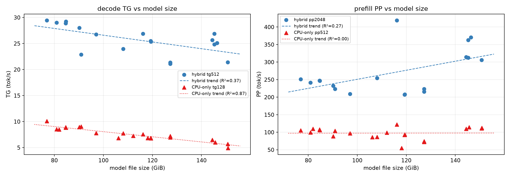

# PeoplesLLM

> **[English README](README.en.md)**

**让 200B-3T 级 MoE 模型在本地服务器上跑起来，并把多路 CPU、消费级 GPU 和多机内存叠加起来。**

PeoplesLLM 是面向异构本地推理的 llama.cpp 分支：多 NUMA/多设备执行架构、AVX512 与 GPU 内核、面向计算的 GGUF 权重格式，跨机部分提供独立的专家并行运行时 `tools/epd/`。主模型 attention/dense/router/KV 留在 GPU，routed MoE 专家由双路 CPU 或远程 NUMA worker 执行——多个节点共同计算**同一个 slot、同一层的专家任务**。

平台：双路 Intel Ice Lake-SP（152 逻辑线程，251 GiB）+ 2 x RTX 3090（NVLink P2P）+ ConnectX-5 100G 直连从机。主要模型：DeepSeek-V4 / DSV4-Flash、GLM-5.2。以下数据均为 target-only、无投机口径，标注 `DSpark speculative` 的除外。

## 已验证结果

| 路线 | 配对基线 | 当前结果 | 变化 |
|---|---:|---:|---:|
| DSV4 pp2048，同质量 MXFP4 -> BAKED-MXFP4 | 312.48 tok/s | **362.92 tok/s** | **+16.1%** |
| DSV4 raw/no-DSpark decode，strict 热专家 12 轮 A/B | 25.02 tok/s | **30.23 tok/s** | **+20.85%** |
| DSV4 单 slot raw/no-DSpark，四 worker strict remote-only -> GPU-hot + CPU-remote | 25.25 tok/s | **28.85 tok/s** | **+14.26%** |
| DSV4 单 slot raw/no-DSpark pure EP，2 -> 4 NUMA worker | 22.1 tok/s | **25.2 tok/s** | **+14.03%** |
| DSV4 16K GPU MoE prefill | 213 tok/s | **334.5 tok/s** | **+57%** |
| DSV4 全模型 CPU_REPACK 加载 + smoke | 163.48 s | **98.66 s** | **-39.65% wall** |
| DSV4 DSpark speculative decode，n2/p0 | 23.9 tok/s | **30.1 tok/s** | **+26%** |
| GLM-5.2 pp512，2 -> 4 NUMA worker 真 EP | 24.13 tok/s | **40.59 tok/s** | **+68.2%** |


## 三引擎控制面

异构执行计划由三个逻辑引擎联合生成：

- **TAE**（拓扑感知）：设备、互联、容量与负载；layer/expert/tensor 粒度与 mirror/split/owner 放置。
- **UPE**（统一精度）：权重值合同、执行合同、data epoch 与同步语义；shadow、PPL、hash、accepted/drafted 联合验收。
- **DME**（动态矩阵）：按 TG/PP/verify 形状选 GEMV/GEMM、tile、fusion 与 ISA kernel。

DME 在 TAE 与 UPE 候选交集上最小化当前 phase 关键路径。E4A 是协同案例：TAE 选设备布局，UPE 证明逻辑值与版本合法，DME 选 NR16/VNNI 消费内核。

## 架构数据

### NUMA 行窗 TP（DME）


| 工作负载 | off | on | 变化 |
|---|---:|---:|---:|
| 混合 TG512 | 16.59 | **25.01** | **+51%** |
| 混合 PP2048 | 267.05 | **298.98** | +12% |
| 纯 CPU TG128 | 7.23 | **11.65** | **+61%** |
| 纯 CPU PP512 | 101.41 | **107.91** | +6.4% |

### GPU 混合执行


| 路径 | 基线 | 优化后 | 改善 |
|---|---:|---:|---:|
| 双 GPU TP decode | 13.6 tok/s | 20.3 tok/s | +49% |
| 16K GPU MoE streamed prefill | 213 tok/s | 334.5 tok/s | +57% |
| strict+AVX E4A/MXFP4 top-24 raw TG | 25.0167 tok/s | 30.2333 tok/s | +20.85% |
| GPU-hot + 四 CPU EP raw TG | 25.25 tok/s | 28.85 tok/s | +14.26% |

strict slot-order + AVX512 组合通过 TG/PP/PPL 三门：TG +20.85%，PP2048 361.47，5-chunk PPL 2.7758 -> 2.7548（-0.7565%）。

### 多机 EP


| 测试 | 之前 | 之后 | 变化 |
|---|---:|---:|---:|
| GLM-5.2 MoE pp512，2 -> 4 worker | 24.13 | **40.59** | **1.682 x** |
| DSV4 raw/no-DSpark TG512，2 -> 4 worker | 22.1 | **25.2** | **1.140 x** |
| DSV4 raw/no-DSpark TG512，strict remote-only -> GPU-hot+CPU-remote | 25.25 | **28.85** | **+14.26%** |
| 64 B RPC RTT，TCP -> RoCEv2 | 42-74 us | **10-13 us** | 约 4-6 x |

| 实验 | 数据 | 判定 |
|---|---|---|
| DSpark NMAX=2 多 token 桥接 | K24 唯一过 PPL 门（2.7412） | warm-server +4.928% < 5% 门，default-off |
| MAX_EFFORT 副本图 | strict/max 同正文同 PPL 2.7520 | paired TG +3.18%，数值透明 |
| E8M0 合同修正 | PPL 对旧基线 +0.394% | REJECT，不沿用旧基线 |

## 内核数据

### 格式体积 vs 吞吐（decode 不是严格的体积约束）

| 观测 | 数据 |
|---|---|
| 17 点混合矩阵拟合 | TG/体积 R²=0.50，PP/体积 R²=0.25 |
| 反例：大文件更快 | Q4_K_XL 144 GiB 比 IQ4_XS 127 GiB 快 21.6% TG、45.5% PP |
| 流式烘焙 | 加载 wall -30~40%、RSS -46%，吞吐 2σ 内不变 |



### 流式烘焙

覆盖 K-quant、IQ、MXFP4、E4A；真实 tensor 与全模型数据：

| 对象 | 旧 | 烘焙 | 结果 |
|---|---:|---:|---|
| 1.14085 GB MXFP4 tensor | 3.23 s | 2.12 s | RSS -46%，hash 一致 |
| 822 MB IQ3_XXS tensor | 4.37 s | 3.11 s | RSS -44.6%，hash 一致 |
| 145.26 GiB 全模型 load+smoke | 163.48 s | 98.66 s | -39.65% |
| NUMA-EP load+PP/TG 三轮 wall | 256.83 s | 177.55 s | TG 差 <2σ |

### arec / 归并

- arec panel-stationary：UDNL_W4 PP 263.33 -> **366.58**（+39%）；UDNL_MX 修复后 418.95±3.50。
- 严格 router-slot 左折叠 + AVX512 merge：AVX512 15.41x（29,681.8 -> 1,926.6 ns/layer），PPL 2.7846 -> 2.7548 过门。
- Q8/数据等其余已实现内核见 [BENCHMARKS](docs/BENCHMARKS.md)。

## 格式数据


| 格式 | 体积 | pp2048 | tg512 | PPL | 定位 |
|---|---:|---:|---:|---:|---|
| MXFP4 | 145.26 GiB | 312.48 | 26.87 | 3.5830 | 锚点 |
| **UDNL_W4 + arec** | 146.36 GiB | 370.87 | 25.10 | 3.7997 | 4-bit 计算亲和 |
| **UDNL_MX + arec（corrected）** | 116.13 GiB | 418.95±3.50 | 26.90±0.25 | 4.6047 | 容量/PP；PPL 比 Q3_K_XL 差 14.6% |
| **BAKED-MXFP4 (E4A)** | 145.26 GiB | 362.92 | 24.83 | 3.5830 | MXFP4 数值 bit-exact |


## UPE 数值审计

CPU AVX512、CUDA MMVQ、远端 worker 即使读取相同权重，也可能因 Q8 激活量化、舍入、累加树、FMA 与非线性策略不同而产出不同专家向量。逐路径可重复不等于跨设备一致；DSpark 下 near-tie logits 的微小变化可翻转 target token。

**证据与干预（全部 default-off）：**

| 实验 | 数据 | 判定 |
|---|---|---|
| Q8 produced-code 对拍 | 真实 15.68M values 中 34 个 CPU/GPU code 不同（2.17 ppm），scale 全一致；half-step 合成 1876/4096 | verify 必须对拍实际 code/scale，不只公式名 |
| hot-scoped CPU-Q8 | code mismatch 33/10,144 -> 0；warm-server TG +8.26%、acceptance 266/490 -> 273/474 | 5-chunk PPL 2.7855 越 0.3% 门，REJECT |
| E8M0 0xff 权重语义 | CUDA 原生 NaN vs CPU 2^127 half-scale；统一后 edge 逐位一致；全局置零 PPL +0.56% | 保留 CPU 语义；值合同变更须重过质量门 |
| exclude 21:202,21:205 | layer21 RMSE 0.019 -> 1.69e-5；10-chunk PPL 2.5843 过门 | 三提示 warm-server 34.124 -> 33.019（-3.24%），default-off |
| 六 cell ISA/Vulkan 审计 | scalar/AVX2/AVX512-VNNI-on-off/CUDA/Vulkan 各自确定；same-top 96.1%–100%；首差瀑布 Q5 dot -> RoPE -> Q8 V -> QK 归约 | 探索性：ISA/backend 构成有效模型的一部分 |

## 构建与使用

```bash
# CUDA 混合
cmake -B build-cuda -DGGML_CUDA=ON
cmake --build build-cuda -j

# 纯 CPU
cmake -B build-cpu -DGGML_CUDA=OFF
cmake --build build-cpu -j

# DSV4 单机混合：GPU dense/attention/KV，双路 CPU routed experts
GGML_NUMA_EP=1 build-cuda/bin/llama-server \
  -m /path/to/model.gguf -ngl 99 -ncmoe 99 \
  -t 72 --threads-batch 72 --numa distribute -fa on -b 4096 -ub 1024
```

`tools/peoplesllm-run.sh` 提供 `dsv4-prod`、`dsv4-dual`、`glm-dual`、`cpu-pure` profile。worker、RDMA/TCP 回退与完整参数见 [QUICKSTART](docs/QUICKSTART.md)、[PARAMETERS](docs/PARAMETERS.md)、[EPD 文档](tools/epd/README.md)。

## 测量与正确性

- A/B 使用同模型、prompt、线程与 offload；关键结论 ABBA/反序重复；固定 seed 贪婪输出逐字节或 SHA256 对拍。
- `pp`/`tg` 为 llama.cpp bench 口径，不代表任意并发、上下文或硬件上的 SLA。
- 完整数据：docs/[BENCHMARKS.md](docs/BENCHMARKS.md)、[CHANGES.md](docs/CHANGES.md)、[ARCHITECTURE.md](docs/ARCHITECTURE.md)。

## 许可证

本项目是 [llama.cpp](https://github.com/ggml-org/llama.cpp) 的分支，版权归 ggml-org 及贡献者所有，MIT 许可。本分支改动同样 MIT，保留原版权声明与 [LICENSE](LICENSE)。
