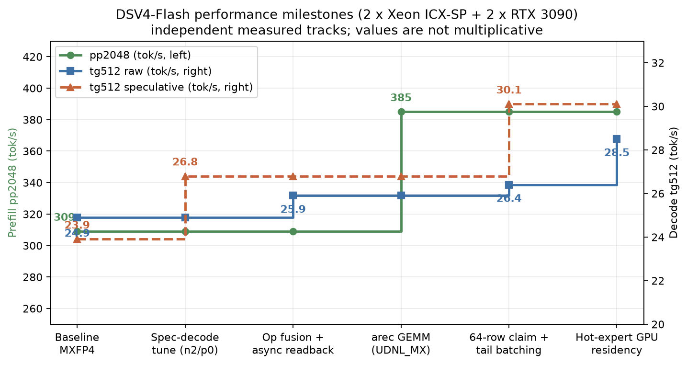
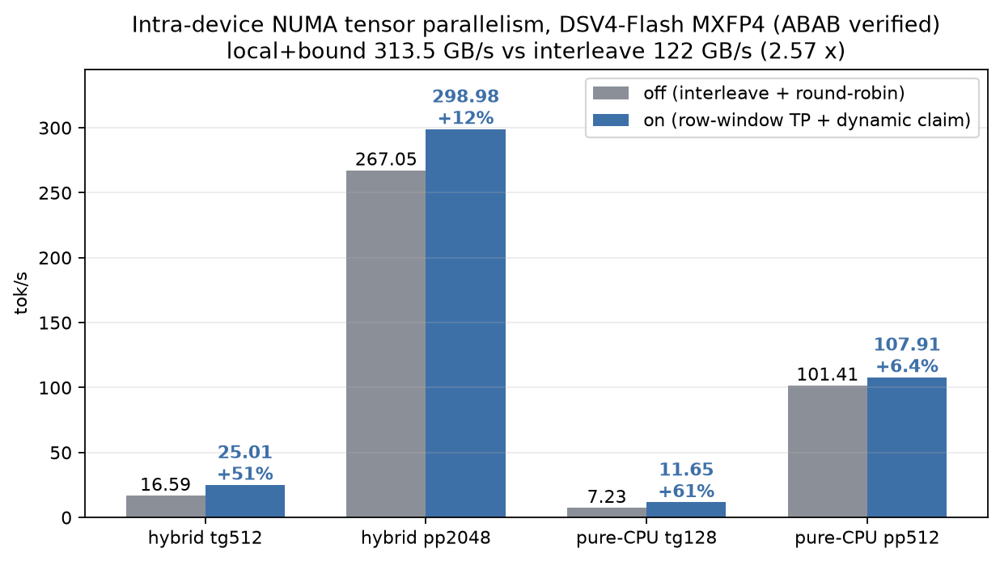
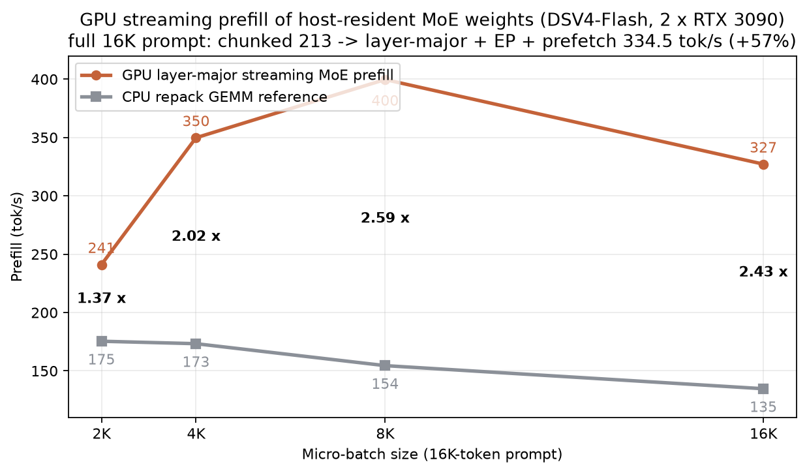
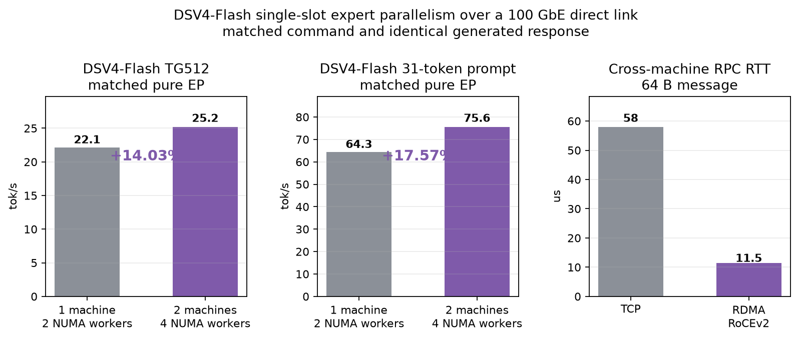
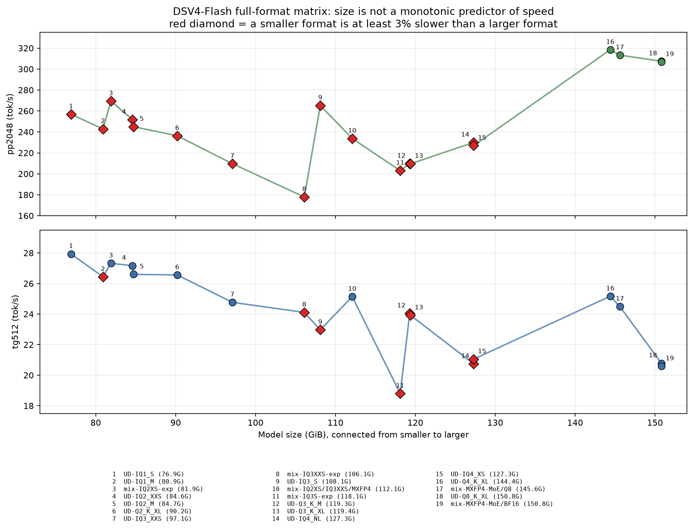
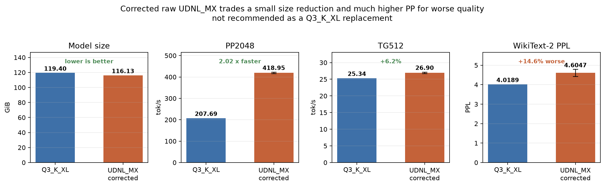

# PeoplesLLM

> **[English README](README.en.md)**

**让 200B-3T 级 MoE 模型在本地服务器上跑起来，并把多路 CPU、消费级 GPU 和多机内存真正叠加起来。**

PeoplesLLM 是面向异构本地推理的 llama.cpp 分支。项目围绕三条相互衔接的主线演进：多 NUMA/多设备执行架构、AVX512 与 GPU 内核、面向计算的 GGUF 权重格式；跨机部分提供独立的专家并行运行时 `tools/epd/`。

## 项目定位

主模型的 attention、dense、router 和 KV 可留在 GPU，routed MoE 专家由双路 CPU 或远程 NUMA worker 执行。目标不是让每个节点各跑一份模型或多个 slot，而是让多个 NUMA 节点共同计算**同一个 slot、同一层的专家任务**。

项目由作者确定架构和硬件方向，在 AI 辅助下完成实现、测试与调优。所有公开性能结论均来自同机、同口径的实测；项目仍处于研究和工程化阶段，生产使用前应在目标硬件上完成输出与容量验收。

主要测试平台：双路 Intel Ice Lake-SP（152 逻辑线程，251 GiB DDR4-3200）+ 2 x RTX 3090 24 GiB（NVLink P2P）以及一台通过 ConnectX-5 100 GbE/RoCEv2 直连的双路 Ice Lake-SP 从机。主要调优模型为 DeepSeek-V4 / DSV4-Flash 和 GLM-5.2。

## 已验证结果

下表中的每一行都是独立测试口径，不能将不同行的百分比直接相乘。Decode 数据统一显式标记为 `raw/no-DSpark` 或 `DSpark speculative`；PP 是 prefill，不包含 draft 接受收益。

| 路线 | 配对基线 | 当前结果 | 变化 |
|---|---:|---:|---:|
| DSV4 pp2048，同质量 MXFP4 -> E4A | 312.48 tok/s | **362.92 tok/s** | **+16.1%** |
| DSV4 145.26 GiB 全模型 CPU_REPACK 加载 + smoke | 163.48 s | **98.66 s** | **-39.65% wall** |
| DSV4 DSpark speculative decode，n2/p0 | 23.9 tok/s | **30.1 tok/s** | **+26%** |
| DSV4 E4A raw/no-DSpark decode，strict 热专家 12 轮 A/B | 25.02 tok/s | **30.23 tok/s** | **+20.85%** |
| DSV4 16K GPU MoE prefill | 213 tok/s | **334.5 tok/s** | **+57%** |
| DSV4 单 slot raw/no-DSpark pure EP，2 -> 4 NUMA worker | 22.1 tok/s | **25.2 tok/s** | **+14.03%** |
| DSV4 单 slot raw/no-DSpark，四 worker strict remote-only -> GPU-hot + CPU-remote | 25.25 tok/s | **28.85 tok/s** | **+14.26%** |
| GLM-5.2 pp512，2 -> 4 NUMA worker 真 EP | 24.13 tok/s | **40.59 tok/s** | **+68.2%** |



## 三引擎控制面

PeoplesLLM 把一次异构执行计划拆成三个边界明确的逻辑引擎：

- **TAE（Topology-Aware Engine）**管“在哪里算、数据物理放在哪里”：感知 core/cache、CCD/die、NUMA/UPI、GPU/PCIe 与远端 worker，选择 layer/expert/tensor 粒度、mirror/split/owner和设备原生权重布局，并对 PCH/南桥 PCIe 等高代价拓扑给出警告。
- **UPE（Unified Precision Engine）**管“还是不是同一模型语义”：维护 canonical tensor/data epoch、副本同步、激活量化、舍入/累加、非线性和 slot fold 契约，并用 shadow、PPL、hash 与 DSpark accepted/drafted 联合验收。
- **DME（Dynamic Matrix Engine）**管“当前 phase 怎样算最快”：针对 TG、PP 和 speculative verify 的 shape，选择 GEMV/GEMM、tile、batch/ubatch、fusion/pipeline 以及 AVX512-VNNI、未来 AMX 或 CUDA kernel。

决策关系可写成：**TAE 生成物理可行域，UPE 过滤数值与数据不合格路径，DME 在二者交集上最小化当前 phase 的关键路径**。E4A 因此不是单一引擎的功能：TAE 选设备布局，UPE 证明逻辑值/版本合法，DME 选择 NR16/VNNI、AMX 或 GPU 消费内核。

## 架构发展路线

### 1. NUMA 塌方：从测量开始

双路机器上的朴素 interleave 会让大量权重读取跨 UPI，同时所有线程在 barrier 上等待最慢者。实测内存流式读取为 **122 GB/s（interleave）对 313.5 GB/s（本地页 + 本地绑核）**，相差 2.57 x。MoE decode 恰好是短 burst、低算术强度的带宽型负载，因此普通的“多开线程”并不能解决问题。

### 2. Mirror：先消除跨路读取

`--numa mirror` 让每个 socket 持有一份完整权重副本，并把线程和页面绑定到同一节点。它将跨 UPI 的专家权重流量降为零，DSV4 raw/no-DSpark tg512 达到 30.35 tok/s，对同机上游 distribute 的 26.9-28.0 tok/s 提升约 8%-13%。代价是专家权重占用双倍内存。

### 3. NUMA EP：内存减半，但静态专家归属不够

下一步把每个专家只放在一个节点。专家权重内存减半，pp512 与 mirror 基本持平（343-348 对 338-347 tok/s）；但 batch=1 时，一个专家是一条不可继续切分的 GEMV，静态“8 个激活专家分进 2 个节点”会产生尾部气泡，raw/no-DSpark tg512 只有 23.9-24.2 tok/s。这个阶段给出了关键约束：**专家放置必须保留细粒度并行和动态调度自由度。**

### 4. NUMA 行窗 TP + DME

最终将每个专家平面按 128 行窗口交替放到两个节点，执行时再以 64 行 claim 量子动态领取任务。每个专家都由两路共同读取，输出行只有一个写入者，不需要跨节点归并。环境变量仍沿用 `GGML_NUMA_EP=1`，但执行语义已经是专家内部的 row-window tensor parallelism。



| 测试形态 | 关闭 | 开启 | 变化 |
|---|---:|---:|---:|
| 混合 raw/no-DSpark tg512 | 16.59 | **25.01** | **+51%** |
| 混合 pp2048 | 267.05 | **298.98** | +12% |
| 纯 CPU raw/no-DSpark tg128 | 7.23 | **11.65** | **+61%** |
| 纯 CPU pp512 | 101.41 | **107.91** | +6.4% |

在行窗 TP 之上，DME（Dynamic Matrix Engine）继续处理节点内的不规则 MoE 形状：

- claim 量子从 16 调到 64 行，微基准带宽由 145 提升到 165-179 GB/s；
- 按 `nrows` 和 batch 形状在 GEMV/GEMM 之间分派，并把 UDNL 同专家的 2-8 行尾部任务合并；
- 修正线程绑核与行窗归属不一致的问题，`MUL_MAT_ID` 从 155.7 降到 88.4 us/call；
- 两级 NUMA barrier 和重复专家感知调度降低尾部等待。

### 5. GPU 混合执行

在生产型混合路径中，GPU 处理 attention、dense、router 和 KV，CPU 处理 routed experts。针对不同阶段形成了三种互补机制：

- **热专家驻留**：top-24 专家/层覆盖约 57.6% 的选择，43 层紧凑 MXFP4 权重为 12.85 GiB。GPU 热分支与 CPU 冷分支在图内 fork/join；GPU 回传逐 router-slot 结果，CPU 按 slot 0..5 恢复基线左折叠，AVX512 只跨 hidden rows 向量化。12 轮 raw/no-DSpark tg512 从 25.0167 提升到 30.2333 tok/s（+20.85%）；PP2048 为 361.47 tok/s，5-chunk PPL 从 2.7758 改善到 2.7548。
- **NVLink P2P TP**：捕获安全的 P2P allreduce 和异步 D2H 回读把 raw/no-DSpark TP 路径自身从 13.6 提升到 20.3 tok/s（+49%），每 token 的 `cudaStreamSynchronize` 约从 690 次降到 150 次。该数字是 TP 路径内部 A/B，不等于单卡最优路径。
- **MoE 流式 prefill**：专家权重保留在 host pinned memory，长 prompt 时按层上传、跨 tile 复用，并用双卡 expert-axis EP 和 3-slot 预取隐藏 H2D。



| 16K prompt | tok/s |
|---|---:|
| chunked token-major | 213 |
| layer-major + pipe + device-HC | 248.5 |
| + 双卡 EP + `PREFETCH=2` | **334.5** |

### 6. 多机 EP：多个 NUMA worker 共同算一个 slot

`tools/epd/` 只传输 KB 级激活和结果，不在请求期间搬运专家权重。master 和 slave 的每个 NUMA node 都可以成为独立 worker；strict pure EP（`SCHED_KLOCAL=0`）下，master 不需要保留 routed experts 的完整副本。运行时根据真实 router 频率构建带热点副本的 holder map，再按在飞工作量动态派单。



| 测试 | 之前 | 之后 | 变化 |
|---|---:|---:|---:|
| GLM-5.2 MoE pp512，2 -> 4 worker | 24.13 | **40.59** | **1.682 x** |
| DSV4 MXFP4 raw/no-DSpark TG512，2 -> 4 worker | 22.1 | **25.2** | **1.140 x** |
| DSV4 raw/no-DSpark TG512，四 worker strict remote-only -> GPU-hot + CPU-remote | 25.25 | **28.85** | **+14.26%** |
| DSV4 16K PP，UB64 -> UB256 | 235.37 | **269.36** | +14.4% |
| 64 B RPC RTT，TCP -> RoCEv2 | 42-74 us | **10-13 us** | 约 4-6 x 降低 |

GLM 的 dense/attention 仍在 GPU；上表第一行只扩展 CPU MoE。75 层 raw/no-DSpark MoE decode 合计由 86.71 降到 69.58 ms/token（1.246 x），128-token 输出逐字节一致。另一组明确启用 DSpark speculative（NMAX=3）的 DSV4 四 worker pure EP + RDMA 验收均值为 37.921 tok/s、峰值 38.423 tok/s，输出 SHA256 与同口径单机参考一致；它不与上表 raw 25.2 tok/s 混算。

2 -> 4 的 DSV4 行是单 slot、同 master、同模型和同命令的 matched single run：两路本地 worker 各持有 128 个专家，四路跨机 worker 各持有 64 个专家；master 在 `KLOCAL=0` 下跳过全部 routed-expert 权重。两种拓扑的生成正文 SHA256 相同。该系统级结果受两台机器核数不同和网络延迟影响，不代表理想 2 x 扩展。

GPU-hot + CPU-remote-EP 现已在一个严格限定的端到端形态下通过：单 slot、raw/no-DSpark、四 worker modulo strict cover、同步 REQ4，未启用 MAX_EFFORT。TG512 的 ABBA+BAAB 八轮为 A(remote-only) `[24.9, 25.2, 25.5, 25.4]`、B(K24 hot + remote cold) `[29.6, 28.3, 28.6, 28.9]` tok/s，均值 25.25 -> **28.85 tok/s（+14.26%）**；同命令 b1/ub1、5-chunk PPL 为 2.7647 -> **2.7412（-0.85%）**。A、B 各自四轮输出 hash 稳定，但两模式 hash 不同，因此这不是跨 CPU/GPU kernel 的 bit-exact 声明。所有 B 轮均有 43/43 hot-fork 与 43/43 remote-bridge marker。

八 token verbose 诊断只用于验证结构，不是性能样本：301 次单 token MoE 调用中，CPU assignment 从 1,806 降到 916（-49.28%），四端点累计为 239/220/213/244，全四路 fanout 从 117 降到 18 次，remote wait 均值从 0.444 降到 0.310 ms，mixed merge 均值为 0.0296 ms。这些 raw/no-DSpark 百分比不能与其他路径相乘。

DSpark multi-token 桥接已进一步扩展到1-4 target tokens，REQ4 mask和严格merge均使用`[token,slot]`布局。K24是唯一通过质量门的热专家数：5-chunk PPL 2.7647 -> 2.7412。但warm server实测中，NMAX=3仅35.251 -> 35.950 tok/s（+1.98%）；NMAX=2的两个独立B进程六轮均值为36.353，对A=34.645提升**4.928%**、CV=2.466%，比预设5%门低0.072个百分点。因此该路径保留default-off研究开关，不替换生产默认，也不声称达到40 tok/s。

进一步的UPE消融仅对`hot_expert.*`启用CPU Q8_0同款RNE code生成，将真实激活的CPU/GPU code mismatch从33/10,144降到0（scale仍0 mismatch）；相同code后普通MXFP4算子仍有约2.29e-7–4.80e-7相对误差，来源转为CUDA warp归约。NMAX=2 warm-server A-B-B-A中，普通路径为35.0614±0.2720，CPU-Q8候选为37.9573±0.4868 tok/s（+8.2595%），acceptance从266/490变为273/474，两边各自hash稳定但轨迹不同。候选5-chunk PPL却为2.7855，比原strict-hot 2.7412差1.62%、比no-hot 2.7647差0.75%，超过0.3%门，且绝对速度仍低于40。因此`GGML_CUDA_HOT_MXFP4_CPU_Q8`继续默认关闭、生产REJECT；该结果说明code一致和acceptance改善都不能替代无DSpark质量门。

### 7. 统一精度引擎：混合 EP 的数值与数据控制面

CPU AVX512、CUDA MMVQ和远端worker即使读取相同逻辑权重，也可能因Q8激活量化、舍入、scale恢复、累加树、clamp/GLU和FMA策略不同而产生不同专家向量。每条路径各自可重复，并不等于跨设备结果一致；在DSpark中，near-tie logits的微小变化还可能翻转target token，降低draft接受率并改变后续轨迹。因此PeoplesLLM把统一精度引擎（Unified Precision Engine, UPE）视为混合EP的组成部分，而不是事后正确性测试。UPE同时管理副本对应的logical tensor、data epoch与发布完成语义，不只是浮点容差测试。

证据口径分三层：如果只改变accepted/drafted而最终target token相同，只能说明投机效率受影响；如果pure CPU与GPU expert offload在固定greedy配置下各自确定却生成不同target token/正文，已经证明两条路径实现了不同的有效模型并可能影响生成质量；只有无DSpark配对PPL、任务准确率和行为评测才能判断质量变化的方向与幅度。DSpark是敏感的误差放大器，不是独立质量指标。

当前已实现逐slot回传、0→5严格左折叠、CPU/GPU shadow以及PPL、response hash和accepted/drafted联合门。EPD CAP现在可协商precision-contract，包含activation/dot/FFN schema/per-slot merge、model schema、data epoch与contract hash；`GGML_REMOTE_EP_UPE_STRICT=1` 会拒绝缺合同、跨worker不同或重连后变化的endpoint，并要求master/worker共享非空`GGML_EP_DATA_EPOCH`。该协议已通过CUDA/non-CUDA构建、单测和DSV4真实四worker验收：主从各两个e64 worker全部报告相同contract/schema/epoch，strict REQ4的32-token smoke为PP 52.4/TG 24.7~tok/s；故意错误epoch会在第一个CAP阶段拒绝。这个短样本只是协议/功能门，不与TG512 headline比较。K16虽然显著提速，却使PPL 2.7647→2.8066；K24才通过质量门。shadow还表明最大局部误差专家并不等于质量根因，排除它们反而更差。投机verify仍需要比普通raw decode更严格的激活code/scale和接受率档。

直接回读CUDA Q8\_1临时块的新回归测试进一步给出了边界：平滑输入的4096个code和FP16 scale全部与CPU Q8\_0一致；half-step输入中CPU/GPU有1876个code不同，但scale仍0 mismatch，而GPU实code与主机模拟的CUDA公式也有470个不同。因此verify-strict必须对拍设备实际产出的code/scale，不能只比较公式名称。

真实DSV4全量回放中，15,675,392个hidden值只有34个CPU/GPU code不同（2.17 ppm）、scale全部相同，差异值距half-step最大1.5259e-5。基于此实现了default-off的边界fallback：raw低阈值64-token短跑回退37个layer-token/112 hot slots，恢复CPU remote-only正文hash，TG为27.2（CPU 25.1，普通GPU-hot 28.5）。DSpark NMAX=2的nominal-only形态为34.8 tok/s、67/120 accepted/drafted，介于CPU 31.2、66/122与普通GPU-hot 37.9、66/122之间；接受改善只有1 token且正文未回到CPU hash。该策略因样本与性能门不足继续default-off，不作生产或通用提速主张。

另一个default-off phase selector（`GGML_HOT_EXPERT_UPE_VERIFY_CPU=1`）在n_tokens>1时完全跳过GPU-hot提交，用来消除duplicate fallback税。同一DSpark测试中2,895次multi-token layer全部走CPU，结果30.7 tok/s、66/122，正文hash与CPU remote-only完全一致，但也没有任何净提速。这证明剩余轨迹差异来自multi-token GPU expert execution；下一落点是统一CUDA Q8/dot/累加/clamp-SwiGLU契约，而不是绕过GPU。

进一步的weight-value审计找到layer21 expert202/205中7个OCP保留`E8M0=0xff`块和249/250极端有限指数。原CUDA原生转换对0xff产生NaN，CPU_REPACK历史路径则使用half-scale=$2^{127}$；一个e8m0-edge测试中CUDA曾有1536/1536非有限输出。当前不改CPU历史语义，而在CUDA MXFP4 MMVQ对0xff显式使用相同half-scale；0xff-only、e250-only和组合edge已全部CPU/GPU逐位一致。全局`0xff→0`方案因pure-CPU PPL 2.7647→2.7801（+0.56%）被否决并回退。

对真实极端块，只统一0xff仍会因巨大正负项的累加次序产生误差，因此TAE/UPE放置规则用`GGML_HOT_EXPERT_EXCLUDE=21:202,21:205`使两个专家强制CPU，并用同层下一热点补足K24。候选单run为37.2 tok/s、66/120=55.0% acceptance。10-chunk PPL为2.5843，对CPU2.5853改善0.039%。但三提示ABCABC warm-server中均值从普通hot的34.124降到33.019 tok/s（-3.24%）；两组正文/acceptance不变，另一组从61/130降到56/140并改变正文。每个placement内部的重复hash都一致，所以这是稳定placement效应，不是随机抖动。候选未改善跨提示Pareto，继续default-off，仅作UPE因果/负结果研究。

另一个更强的反例来自hot-scoped CPU-Q8：它把produced activation code差异完全清零，并在warm-server中同时提高速度与accepted tokens，但PPL反而显著越门。UPE因此不能停在code/scale合同；partial accumulation、epilogue、完整expert输出和无投机质量仍是独立发布条件。

## 内核发展路线

### AVX512 repack：先让所有 MoE 分支进入批量内核

早期审查发现 `mul_mat_id` 的多个分支仍逐行调用 `vec_dot`，大 batch 没有进入 GEMM；CUDA 构建中的 buffer-type 顺序还可能让 CPU 权重落入不支持 repack 的 pinned buffer。项目补齐 Q2_K-Q6_K、Q8_0、MXFP4 和 IQ 系列的 8 x 8 repack traits、加载期重排、GEMV/GEMM 分流与 EPD worker 路径。

### arec panel-stationary：权重只从 DRAM 流过一次

arec（activation record）把 Q8 激活和 scale 预计算一次，随后让权重 panel 驻留 L1/L2，并跨 8 行 tile 复用。端到端 pp2048：

- UDNL_W4：263.33 -> **366.58 tok/s（+39%）**；
- 修复 imatrix 契约并重新量化后的 UDNL_MX 达到 **418.95±3.50 tok/s**。

### 融合和异步边界

- DSV4 router 的 5-kernel 链融合为单 warp kernel，小行 indexer top-k 合并为单 radix kernel；GPU busy 18.76 -> 18.23 ms/token，raw/no-DSpark tg 25.15 -> 25.91；
- pinned staging + event drain 将 CPU input readback 从 13 降到 4.6 ms/token；
- MXFP4 repack GEMV 软件预取带来 +2.6% raw/no-DSpark TG；
- 64 行 claim 与 UDNL 尾行批量化把 DSpark speculative n2/p0 从 26.50 提升到 30.10 tok/s，同时保持接受率和输出一致。

### 通用加载期动态流式烘焙

磁盘继续保存兼容 GGUF row blocks；`GGML_STREAM_BAKE=1` 在非 mmap 的 CPU_REPACK 加载中用双 staging `pread`，边读边写最终 CPU panel。当前覆盖 Q3_K/Q4_K、IQ2_XXS/IQ2_XS/IQ3_XXS、MXFP4、E4A（以及启用 repack trait 的 Q2_K），不重新量化。真实 MXFP4 1.14085 GB tensor 的整块/流式 FNV-1a64 都是 `84d0d08b79287973`，wall 3.23→2.12 s、峰值 RSS 2,420,908→1,307,104 KiB；IQ3_XXS 822.08 MB tensor 也保持 hash 一致，wall 4.37→3.11 s。

145.26 GiB 全模型 load + `pp1` smoke 为 163.48→98.66 s（-39.65%）。带 NUMA-EP 的 PP256/TG128 三轮总 wall 为 256.83→177.55 s（-30.87%）；PP mean 229.87→230.14，TG 27.14±0.13→26.75±0.41，差异不足 2σ，且最终 repack bytes 相同，因此结论是**加载明显加速、推理速度无可检出变化**。1/4/16/64 MiB 扫描只给 4 MiB 约 1% 局部优势，默认仍用更省 staging 的 1 MiB；功能保持 opt-in。

GPU 侧没有照搬 CPU x8。一个零增容 MXFP4 `E8M0-plane + code-plane` 候选虽然让单 projection 的两 token 微核快约 4%–5%，完整 K24/6-slot hot FFN 在 token=1/2/4 都只有约 1.00×，因此已从生产源码删除。这说明局部全局内存合并不等于完整 FFN 收益；后续 GPU 格式必须依赖跨 token/slot tile 复用、算子融合或原生 tensor-core 数据类型。

随后实现的 gate/up + DSV4 clamp + GLU 多 token 融合在完整 hot FFN 内核上为 +6.3%/+4.3%/+2.6%（1/2/4 token），且 fusion on/off 输出逐位一致；但 K24、NMAX=2、四路 remote-EP 的 512-token ABBA-BAAB 为 39.675→39.225 tok/s（-1.13%，on CV3.21%）。GPU 节省被 remote CPU 关键路径隐藏，因此 `GGML_CUDA_MOE_CLAMPED_FUSION` 保持 default-off，不作为端到端提速。

## 格式发展路线

### “Q2_K 为什么比预期慢”的起点

最初一个名为 `Q2_K` 的 90.9 GiB 模型只有 223.60 pp2048 和 22.87 raw/no-DSpark tg512。它的 TG 反而低于更大的 Q3_R（25.30 tok/s），虽然 PP 高于尚未充分优化 GEMM 的 Q3_R（174.60 tok/s）。读取 GGUF metadata 后又发现它实际是 IQ2_XXS（2.0625 bpw），并非 Q2_K。这个“Q2_K < Q3_K”现象最终被拆成格式标注和算子效率两个问题：文件更小不代表推理更快，码本查找、scale 展开、反量化长度以及是否能进入批量 GEMM，都会比名义 bpw 更早成为瓶颈。

于是格式设计从“最少比特”转向“存储布局服从内核访问顺序”：

- **UDNL_W4**：定长块，码本结果直接进入 AVX512 VNNI；
- **UDNL_MX**：用 imatrix 在 W2/W3/W4 之间混合分配，再复用同一 arec panel 内核；
- **E4A**：保持 MXFP4 数值 bit-exact，并让 row-block 的 nibble pairing 对齐 NR16 内核；加载时只做无算术的 byte-only panelization，不解码或重新量化。



上图与下表使用 2026-08-24 的统一 `performance` 配方，共 17 个格式点；其中 16 个原矩阵点来自同一二进制，UDNL_MX corrected 在修复后用同硬件、参数和配方补测并替换旧行。固定参数为 `-ngl 99 -ncmoe 99 -fa 1 -dev CUDA0 -sm layer -t 72 --numa distribute -b 4096 -ub 1024 --load-mode none -p 2048 -n 512 -r 3`；152/152 CPU governor 均为 `performance`，EPP 均为 `performance`，turbo 开启，`numa_balancing=1` 已记录。这是单 slot 原始推理结果，未启用 DSpark 或热专家。普通 UD 格式画为圆点，MXFP4 是锚点，自研 UDNL_W4、UDNL_MX、E4A 画为大星，红色空心菱形表示“体积更小但被更大格式反超至少 3%”的异常点。趋势线只拟合普通 UD 点与 MXFP4 锚点，自研格式不参与拟合。

UDNL_MX 已从确认的源重新量化并用相同 `performance` 配方复测，替换图表中的旧污染行；其 PPL 使用 20×512 WikiText-2 历史口径。其余 PPL 沿用同一权重此前的质量测量；CPU 频率不会改变 PPL。`UD-IQ4_XS` 的 PP/TG 是原 3 轮 219.09/21.62 与补充 5 轮 214.03/20.78 按重复次数加权后的 215.93/21.10。`UD-Q4_K_XL` 在当前 loader 中实际被识别为 MXFP4 MoE，不能作为纯 Q4 专家端点。完整 17 点和原始历史口径见 [BENCHMARKS](docs/BENCHMARKS.md)。

| 格式 | 体积 | pp2048 | tg512 raw/no-DSpark | WikiText-2 PPL | 定位 |
|---|---:|---:|---:|---:|---|
| MXFP4 | 145.26 GiB | 312.48 | 26.87 | 3.5830 | 质量与速度锚点 |
| **UDNL_W4 + arec** | 146.36 GiB | 370.87 | 25.10 | 3.7997 | 固定 4-bit 计算亲和布局 |
| **UDNL_MX + arec（corrected）** | **116.13 GiB** | **418.95±3.50** | **26.90±0.25** | 4.6047 | 容量/PP 研究点；质量比 Q3_K_XL 差 14.6% |
| **E4A** | 145.26 GiB | **362.92** | 24.83 | 3.5830 | MXFP4 数值 bit-exact |
| UD-Q3_K_M | 119.28 GiB | 207.20 | 25.49 | 4.0242 | 标准 UD 对照 |
| UD-Q3_K_XL | 119.40 GiB | 207.69 | 25.34 | 4.0189 | 标准 UD 对照 |

UDNL_MX corrected 以比 Q3_K_XL 小约 2.7% 的体积换来约 2.0× PP 和 +6.2% raw/no-DSpark TG，但 PPL 高 14.6%，因此**不推荐作为 Q3_K_XL 的替代品**。当前通过质量门的主线仍是 E4A strict-hot；UDNL_W4 是固定 4-bit 内核研究线。

Q2/Q3/Q4 v1 在 `blk.21` 异常 MXFP4 gate/up 使 Q3 fp16 scale 变为 `inf` 时被门禁拒绝。v2 将完整 gate/up 原子对保留为 MXFP4，并已物化为 **108.816 GiB**、`Q2_K/Q3_K/Q4_K/MXFP4 = 61/56/10/2`，129/129 tensor、文件大小与 SHA 均通过；但同命令 20-chunk PPL 为 **4.7379**，比 matched UD-Q3_K_XL 的 4.0189 差 **17.89%**。质量门已拒绝，按规则未运行 PP/TG，不把 proxy 优势写成可用模型。格式主线因此转向高质量 GGUF 的动态流式烘焙。

UDNL_MX corrected 的 K24 strict-hot raw/no-DSpark pilot 将 TG 从 26.9 提升到 31.3 tok/s（+16.36%），同命令 5-chunk PPL 从 3.5614 改善到 3.5218；但 cold GGUF 与 12.8496 GiB 热权重合计约 **128.978 GiB**，比 Q3_K_XL 大 8.02%，且尚无同命令 Q3 20-chunk 对照。这只是速度/负面质量消融，不是同质量 headline 或推荐配置。



## 构建与使用

```bash
# CUDA 混合构建
cmake -B build-cuda -DGGML_CUDA=ON
cmake --build build-cuda -j

# 纯 CPU 构建
cmake -B build-cpu -DGGML_CUDA=OFF
cmake --build build-cpu -j

# DSV4 单机混合：GPU 跑 dense/attention/KV，双路 CPU 跑 routed experts
GGML_NUMA_EP=1 build-cuda/bin/llama-server \
  -m /path/to/model.gguf -ngl 99 -ncmoe 99 \
  -t 72 --threads-batch 72 --numa distribute -fa on -b 4096 -ub 1024
```

`tools/peoplesllm-run.sh` 提供 `dsv4-prod`、`dsv4-dual`、`glm-dual` 和 `cpu-pure` profile。双机 worker、RDMA/TCP 回退、专家 map 和完整参数请参阅 [快速开始](docs/QUICKSTART.md)、[参数手册](docs/PARAMETERS.md) 与 [EPD 文档](tools/epd/README.md)。线程数和 ubatch 必须按目标 CPU、内存通道、显存和 prompt 长度重新标定。

## 测量与正确性

- 性能 A/B 使用同一模型、prompt、线程与 offload 配置；关键结论用 ABBA/反序重复，避免约 25% 的运行顺序效应。
- 保持归并顺序的路径使用固定 seed、贪婪解码的逐字节输出或 SHA256 对拍。
- 跨设备归并可能因浮点加法顺序在近似并列 logit 上产生单 token 翻转，因此另做 run-to-run 确定性和接受率检查；不会把这种路径写成 bit-exact。
- 图中和表中的 `pp`、`tg` 是 llama.cpp benchmark 口径，不代表任意并发数、上下文长度或硬件上的 SLA。

完整实测数据和口径见 [docs/BENCHMARKS.md](docs/BENCHMARKS.md)，技术改动见 [docs/CHANGES.md](docs/CHANGES.md)。

## 文档

- [快速开始](docs/QUICKSTART.md)：构建、单机/双机配方与常见问题
- [开发者架构](docs/ARCHITECTURE.md)：模块边界、TG/PP/远程 EP 数据流与验证门禁
- [参数手册](docs/PARAMETERS.md)：环境变量、CLI 参数和 profile
- [性能档案](docs/BENCHMARKS.md)：详细 A/B 数据和图表
- [改动清单](docs/CHANGES.md)：NUMA、内核、GPU 与 EP 改动
- [双机 EP](tools/epd/README.md)：worker、传输和部署

## 许可证

本项目是 [llama.cpp](https://github.com/ggml-org/llama.cpp) 的分支。原项目版权归 ggml-org 及 llama.cpp 贡献者所有，并采用 MIT 许可证发布。本分支的改动同样使用 MIT 许可证，保留原版权声明与 [LICENSE](LICENSE)。
